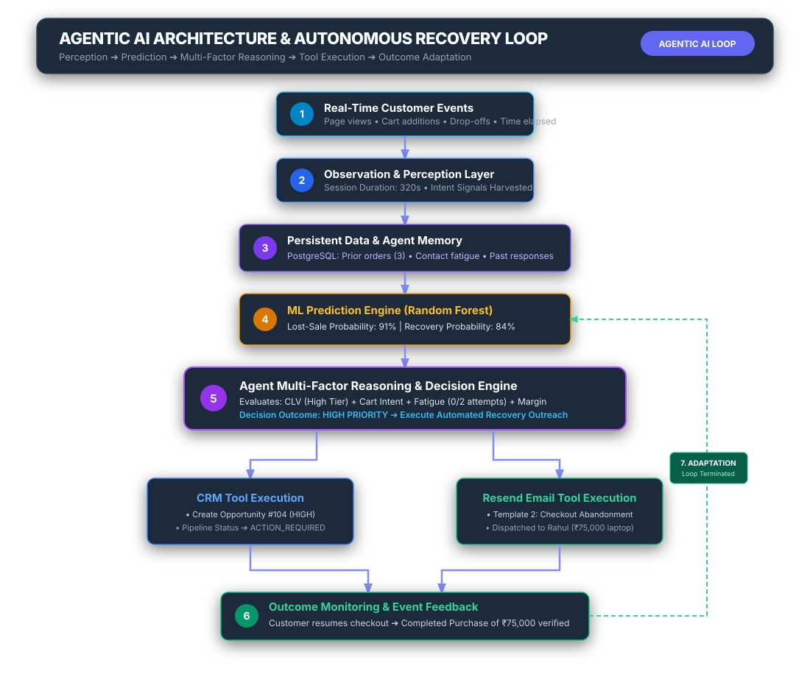
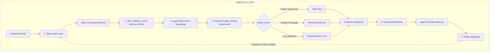

# Agentic AI Architecture – Autonomous Recovery Loop

## Overview
The MissedSale AI Agent functions as an autonomous, goal-oriented system adhering to the 7-stage control loop:
**OBSERVE ➔ ANALYZE ➔ REASON ➔ DECIDE ➔ ACT ➔ MONITOR ➔ ADAPT**

