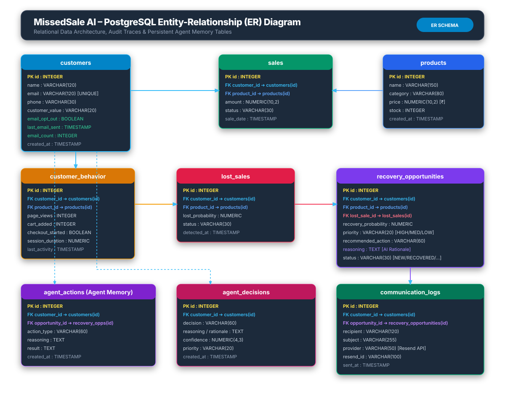
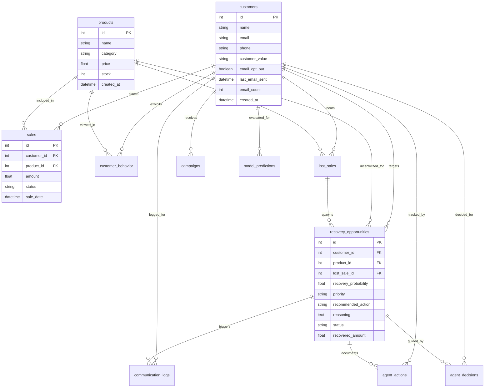

# Database ER Diagram

## Overview
Entity relationship specification across the operational CRM, sales, and persistent agent memory tables.

```mermaid
erDiagram
    customers ||--o{ sales : "places"
    customers ||--o{ customer_behavior : "exhibits"
    customers ||--o{ lost_sales : "incurs"
    customers ||--o{ recovery_opportunities : "targets"
    customers ||--o{ campaigns : "receives"
    customers ||--o{ communication_logs : "logged_for"
    customers ||--o{ agent_actions : "tracked_by"
    customers ||--o{ agent_decisions : "decided_for"
    customers ||--o{ model_predictions : "evaluated_for"
    
    products ||--o{ sales : "included_in"
    products ||--o{ customer_behavior : "viewed_in"
    products ||--o{ lost_sales : "abandoned_in"
    products ||--o{ recovery_opportunities : "incentivized_for"
    
    lost_sales ||--o{ recovery_opportunities : "spawns"
    recovery_opportunities ||--o{ communication_logs : "triggers"
    recovery_opportunities ||--o{ agent_actions : "documents"
    recovery_opportunities ||--o{ agent_decisions : "guided_by"

    customers {
        int id PK
        string name
        string email
        string phone
        string customer_value
        boolean email_opt_out
        datetime last_email_sent
        int email_count
        datetime created_at
    }

    products {
        int id PK
        string name
        string category
        float price
        int stock
        datetime created_at
    }

    sales {
        int id PK
        int customer_id FK
        int product_id FK
        float amount
        string status
        datetime sale_date
    }

    recovery_opportunities {
        int id PK
        int customer_id FK
        int product_id FK
        int lost_sale_id FK
        float recovery_probability
        string priority
        string recommended_action
        text reasoning
        string status
        float recovered_amount
    }
```
