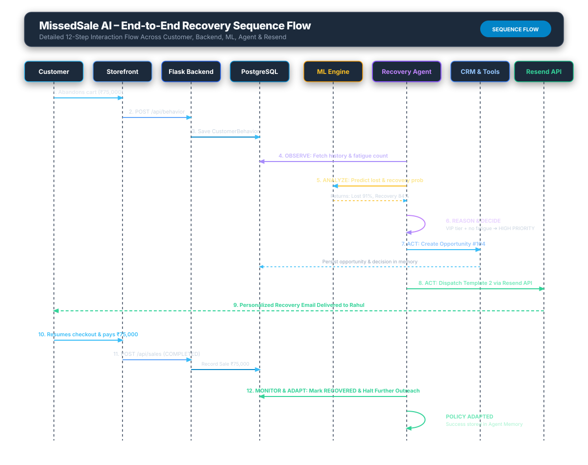
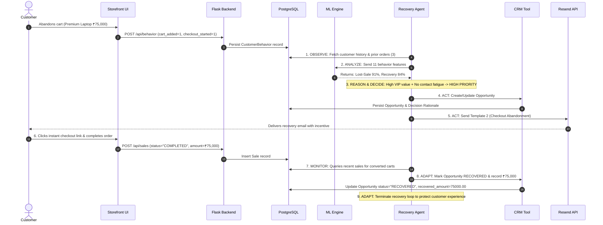

# End-to-End Recovery Sequence Flow

## Overview
Complete 12-step sequence spanning customer drop-off, agent detection, ML inference, decision formulation, Resend API dispatch, purchase conversion, and agent policy adaptation.

