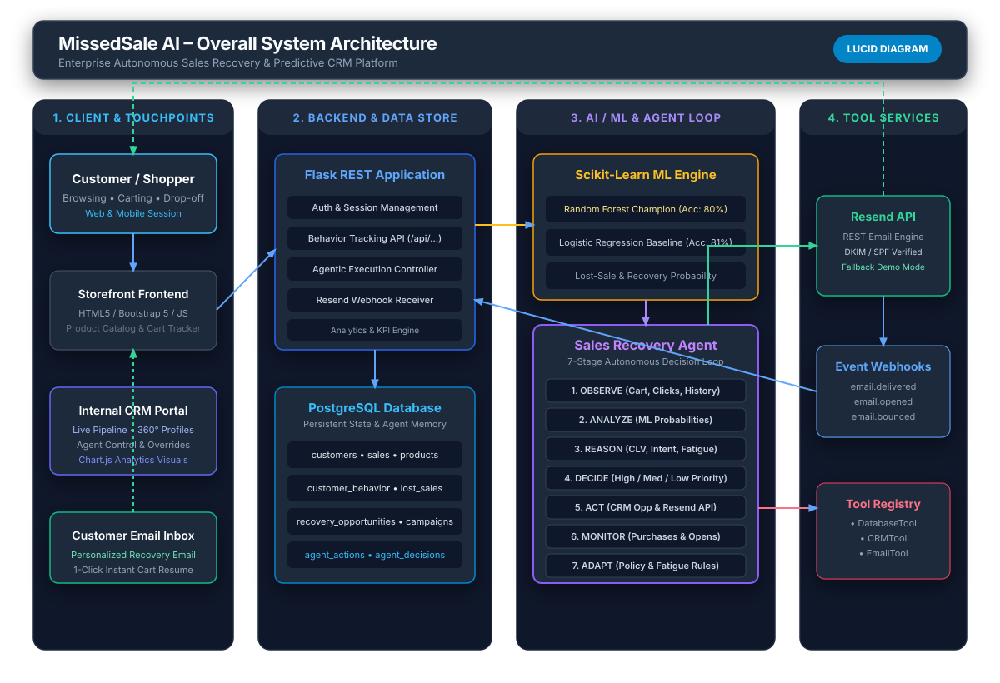
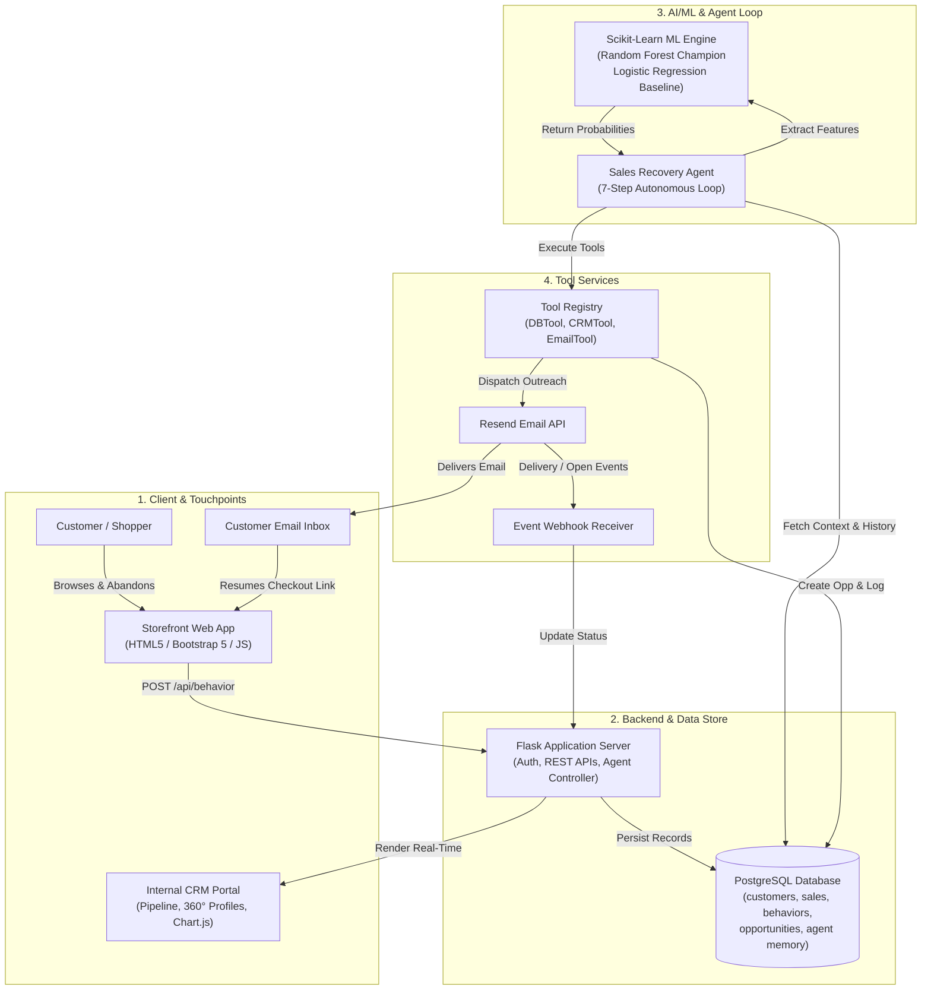

# Overall System Architecture

## Overview
MissedSale AI connects real-time customer behavior streams with an autonomous Agentic AI loop, Scikit-Learn machine learning predictions, PostgreSQL persistence, and Resend email delivery.

