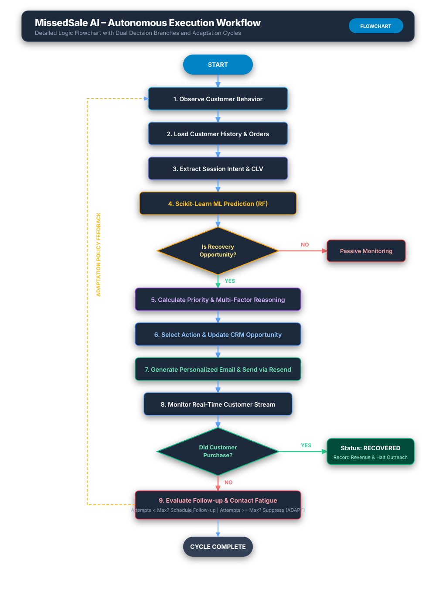
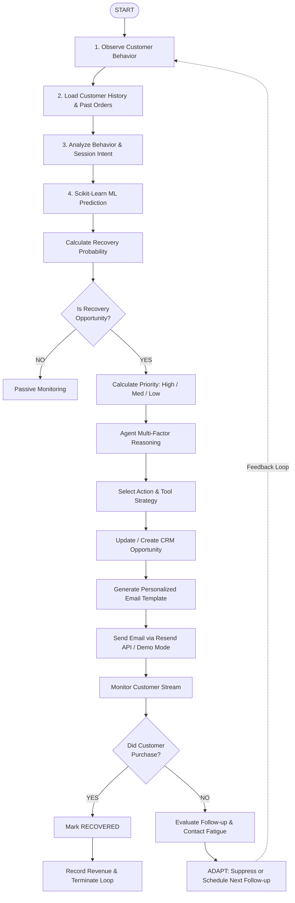

# Autonomous Sales Recovery Flowchart

## Overview
Flowchart demonstrating the decision tree, ML inference thresholds, prioritization logic, tool execution, and adaptation feedback.

```mermaid
flowchart TD
    Start([START]) --> Step1[1. Observe Customer Behavior]
    Step1 --> Step2[2. Load Customer History & Past Orders]
    Step2 --> Step3[3. Analyze Behavior & Session Intent]
    Step3 --> Step4[4. Scikit-Learn ML Prediction]
    Step4 --> CalcProb[Calculate Recovery Probability]
    
    CalcProb --> CheckOpp{Is Recovery<br/>Opportunity?}
    CheckOpp -->|NO| MonitorOnly[Passive Monitoring]
    
    CheckOpp -->|YES| CalcPriority[Calculate Priority: High / Med / Low]
    CalcPriority --> Reason[Agent Multi-Factor Reasoning]
    Reason --> ActionSelect[Select Action & Tool Strategy]
    ActionSelect --> UpdateCRM[Update / Create CRM Opportunity]
    UpdateCRM --> GenEmail[Generate Personalized Email Template]
    GenEmail --> SendEmail[Send Email via Resend API / Demo Mode]
    SendEmail --> MonitorCust[Monitor Customer Stream]
    
    MonitorCust --> CheckPurchase{Did Customer<br/>Purchase?}
    CheckPurchase -->|YES| Recovered[Mark RECOVERED]
    Recovered --> RecRevenue[Record Revenue & Terminate Loop]
    
    CheckPurchase -->|NO| EvalFollow[Evaluate Follow-up & Contact Fatigue]
    EvalFollow --> Adapt[ADAPT: Suppress or Schedule Next Follow-up]
    Adapt -.->|Feedback Loop| Step1
```
